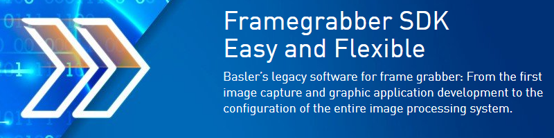

# Framegrabber SDK
Framegrabber SDK sample codes

## C++
### Property
Add paths in C++ project property:
 * VC++ Directories
   * Include Directories
      * $(BASLER_FG_SDK_DIR)\SDKExamples\include;
      * $(BASLER_FG_SDK_DIR)\include
   * Library Directories
      * $(BASLER_FG_SDK_DIR)\lib\visualc

## C#
Add dll to project reference.
### Reference
 * SiSoCsInterface
   * Dll path: $(BASLER_FG_SDK_DIR)\bin\SiSoCsInterface.dll

## Python
### Installation
1. Framegrabber SDK version 5.10.
2. Python. The support version is 3.7 ~ 3.10.
3. Install Numpy by command prompt.
```console
python -m pip install --user numpy
```
4. Set environment variables. 
 * By python:
```python
import os
import sys
framegrabber_sdk_path = os.environ['BASLER_FG_SDK_DIR']
sys.path.insert(0, rf"{framegrabber_sdk_path}\bin")
sys.path.insert(0, rf"{framegrabber_sdk_path}\SDKWrapper\PythonWrapper\python310\lib")
```
 * By manual: Add path in system setting.
### Reference
https://docs.baslerweb.com/frame-grabbers/python-wrapper#installation
